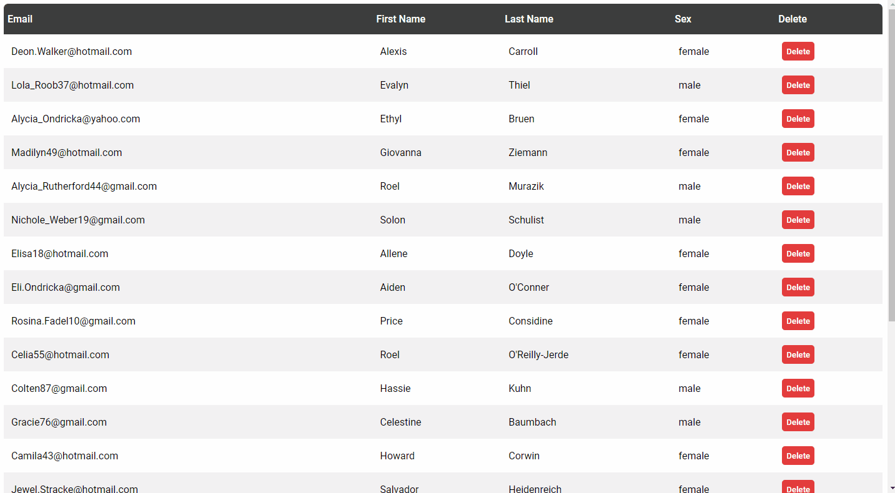

# Neptune

Neptune is a table component that allows you to build tables faster. Just write a small html and observe the results:
```html
<div 
    n-table                                     <!-- Define the table -->
    n-url="/your/data"                          <!-- url to get the data -->
    n-theme="normal"                            <!-- By default is "normal" -->
    n-title                                     <!-- Transform titles from titleName or title_name to Title Name -->
    n-update="/your/data/update"                <!-- Show a modal and update the information using your endpoint -->
    n-key="id"                                  <!-- Define the key so the library can pass the value to your endpoint and know which row to update or delete -->
    n-show-key="false"                          <!-- Don't show the key values -->
    n-delete="/your/data/delete/{key}"          <!-- Show delete button and use your endpoint to delete the row -->
    n-pagination="/your/data/next-page/{page}"  <!-- Show pagination buttons and define the url to get more information -->
    n-load-spinner="normal_spinner"             <!-- Show spinner when information is loading -->
    n-progress-spinner="small_spinner"          <!-- Show spinner when row is updating or being deleted -->
    >
    <!-- These spinners are included in the library -->
    <div id="normal_spinner" class="n-div-spinner">
        <div class="basic-loader"></div>
    </div>
    <div id="small_spinner" class="n-div-spinner">
        <div class="small-loader"></div>
    </div>
</div>
```


Neptune can also show **validation errors**.

# Table of Contents
1. [Installation](#installation)
2. [Basic example](#basic-example)
3. [Update and n-key](#update)
4. [Delete](#delete)
5. [Server side Pagination](#server-pagination)
6. [Client Side Pagination](#client-pagination)
7. [Download as CSV](#csv-download)
8. [Full example](#full-example)
9. [Validation errors](#validation-errors)
10. [Themes](#themes)

## Installation <a id="installation"></a>

Just include the library using the CDN and you are good to go.
```html
<link rel="stylesheet" href="https://cdn.jsdelivr.net/gh/WolfVector/neptune-component/src/neptune.min.css" />

<script src="https://cdn.jsdelivr.net/gh/WolfVector/neptune-component/src/neptune.min.js"></script>
```

Also, you can download the files and use them locally
```js
<link rel="stylesheet" href="neptune.css" />

<script src="neptune.js"></script>
```

## Usage

### Basic example <a id="basic-example"></a>

The `n-url` attribute defines the endpoint from where to get the data. The library expects the data in a `rows` property.

Endpoint example
```js
router.get("/your/data", async function(req, res) {
    const data = await query("SELECT * FROM table")
    res.json({ rows: data })
})
```

Table component
```html
<div 
    n-table                     <!-- Define the table -->
    n-url="/your/data"      <!-- url to get the data -->
    n-theme="normal" 
    n-title                     <!-- Transform titles from titleName or title_name to Title Name -->
    >
</div>
```

### Update and n-key <a id="update"></a>

You can pass the `n-update` attribute to update the information using a modal. To display the modal you double click the row. It's important to provide the `n-key` attribute to define your row key, in this way, the library will pass it to your endpoint. The data to be updated and the key value will be send using the POST method, in the format of a json object.

For example, let's say you have the next endpoint that returns your data:

```js
router.get("/your/data", async function(req, res) {
    const data = await query("SELECT id, email, name, lastName FROM table")
    res.json({ rows: data })
})
```

Then Neptune will use the table fields to construct the json object:

```js
const data = {
    id: keyValue,
    email: emailValue,
    name: nameValue,
    lastName: lastNameValue
}
```
You can use the next table component:

```html
<div 
    n-table                             <!-- Define the table -->
    n-url="/your/data"                  <!-- url to get the data -->
    n-theme="normal" 
    n-title                             <!-- Transform titles from titleName or title_name to Title Name -->
    n-show-key="false"                  <!-- Don't show the key values -->
    n-key="id"                          <!-- Define the key so the library can pass the value to your endpoint-->
    n-update="/your/data/update"        <!-- Show a modal and update the information using your endpoint -->
    n-load-spinner="normal_spinner"     <!-- Id of the spinner when information is loading -->   
    n-progress-spinner="small_spinner"  <!-- Id of the spinner when row is updating or being deleted -->
    >
    <!-- These spinners are included in the library -->
    <div id="normal_spinner" class="n-div-spinner">
        <div class="basic-loader"></div>
    </div>
    <div id="small_spinner" class="n-div-spinner">
        <div class="small-loader"></div>
    </div>
</div>
```

You can use the `n-load-spinner` and `n-progress-spinner` attributes to define the ids of yours spinners. It's very important to put the spinners inside the `div`

### Delete <a id="delete"></a>

The `n-delete` attribute will display a delete button in every row of the table. This attribute must have the pattern: `/your/data/delete/{key}`. You can put the `{key}` substring anywhere you want, this substring gets replaced by the actual key value.

```html
<div 
    n-table                             <!-- Define the table -->
    n-url="/your/data"                  <!-- url to get the data -->
    n-theme="normal" 
    n-title                             <!-- Transform titles from titleName or title_name to Title Name -->
    n-show-key="false"                  <!-- Don't show the key values -->
    n-key="id"                          <!-- Define the key so the library can pass the value to your endpoint-->
    n-delete="/your/data/delete/{key}"  <!-- Show delete button and use your endpoint to delete the row -->
    n-load-spinner="normal_spinner"     <!-- Id of the spinner when information is loading -->   
    n-progress-spinner="small_spinner"  <!-- Id of the spinner when row is updating or being deleted -->
    >
    <!-- These spinners are included in the library -->
    <div id="normal_spinner" class="n-div-spinner">
        <div class="basic-loader"></div>
    </div>
    <div id="small_spinner" class="n-div-spinner">
        <div class="small-loader"></div>
    </div>
</div>
```

### Server Side Pagination <a id="server-pagination"></a>

Use `n-pagination` attribute to show pagination buttons and define your endpoint to get more data. In order to show the pagination buttons you must provide the property `pageNumbers` in your `n-url` endpoint

Endpoint example
```js
router.get("/your/data", async function(req, res) {
    const pages = await query("SELECT COUNT(*) FROM table")
    const data = await query("SELECT * FROM table LIMIT 20")
    res.json({ rows: data, pageNumbers: pages })
})
```

The library will use `pageNumbers` to show the buttons. 

```html
<div 
    n-table                                     <!-- Define the table -->
    n-url="/your/data"                          <!-- url to get the data -->
    n-theme="normal" 
    n-title                                     <!-- Transform titles from titleName or title_name to Title Name -->
    n-show-key="false"                          <!-- Don't show the key values -->
    n-key="id"                                  <!-- Define the key so the above works -->
    n-pagination="/your/data/next-page/{page}"  <!-- Show pagination buttons and define the url to get more information -->
    n-load-spinner="normal_spinner"             <!-- Id of the spinner when information is loading -->   
    >
    <!-- These spinners are included in the library -->
    <div id="normal_spinner" class="n-div-spinner">
        <div class="basic-loader"></div>
    </div>
</div>
```

Also, notice the way you define the `n-pagination` attribute, is identical to `n-delete`. So you can put the `{page}` substring anywhere you want, this substring gets replaced by the actual page value.


### Client Side Pagination <a id="client-pagination"></a>

With client side pagination you can pull all the data you need and add page buttons to better organize the information.

```html
<div 
        n-table                                             <!-- Define the table -->
        n-url="/your/data"                                  <!-- url to get the data -->
        n-theme="normal" 
        n-title                                             <!-- Transform titles from titleName or title_name to Title Name -->
        n-show-key="false"                                  <!-- Don't show the key values -->
        n-key="id"                                          <!-- Define the key -->
        n-update="/neptune/table/update"                    <!-- Show a modal and update the information using your endpoint -->
        n-client-side="20"                                  <!-- Define the number of rows per page -->
        n-delete="/neptune/table/delete/{key}"              <!-- Show delete button and use your endpoint to delete the row -->
        n-load-spinner="normal_spinner"                     <!-- Show spinner when information is loading -->
        n-progress-spinner="small_spinner"          <!-- Show spinner when row is updating or being deleted -->
        >
        <!-- This spinners are included in the library -->
        <div id="normal_spinner" class="n-div-spinner">
            <div class="basic-loader"></div>
        </div>
        <div id="small_spinner" class="n-div-spinner">
            <div class="small-loader"></div>
        </div>
    </div>
```

With `n-client-side` you define the number of rows per page, and based on that Neptune will organize your data.}

### CSV download <a id="CSV download"></a>

You can add a button to download the data as csv using `n-csv="true"`. However, for the moment this functionality only works when you have pull all your data  

```html
<div 
        n-table                                             <!-- Define the table -->
        n-url="/your/data"                                  <!-- url to get the data -->
        n-theme="normal" 
        n-title                                             <!-- Transform titles from titleName or title_name to Title Name -->
        n-show-key="false"                                  <!-- Don't show the key values -->
        n-key="id"                                          <!-- Define the key -->
        n-client-side="20"                                  <!-- Define the number of rows per page -->
        n-load-spinner="normal_spinner"                     <!-- Show spinner when information is loading -->
        n-csv="true"                                        <!-- Show button to download the data as csv -->
        >
        <!-- This spinners are included in the library -->
        <div id="normal_spinner" class="n-div-spinner">
            <div class="basic-loader"></div>
        </div>
    </div>
```

It is not necessary to use `n-client-side` for this to work. As long as you have pull all your data you will be ok. 

### Full example <a id="full-example"></a>

```html
<div 
    n-table                                     <!-- Define the table -->
    n-url="/your/data"                          <!-- url to get the data -->
    n-theme="normal" 
    n-title                                     <!-- Transform titles from titleName or title_name to Title Name -->
    n-update="/your/data/update"                <!-- Show a modal and update the information using your endpoint -->
    n-key="id"                                  <!-- Define the key so the library can pass the value to your endpoint and know which row to update or delete -->
    n-show-key="false"                          <!-- Don't show the key values -->
    n-delete="/your/data/delete/{key}"          <!-- Show delete button and use your endpoint to delete the row -->
    n-pagination="/your/data/next-page/{page}"  <!-- Show pagination buttons and define the url to get more information -->
    n-load-spinner="normal_spinner"             <!-- Show spinner when information is loading -->
    n-progress-spinner="small_spinner"          <!-- Show spinner when row is updating or being deleted -->
    >
    <!-- These spinners are included in the library -->
    <div id="normal_spinner" class="n-div-spinner">
        <div class="basic-loader"></div>
    </div>
    <div id="small_spinner" class="n-div-spinner">
        <div class="small-loader"></div>
    </div>
</div>
```

### Validation errors <a id="validation-errors"></a>

You can show the validation errors returned by your endpoint. Neptune expects this errors to be in the `messages` property. This property must be an array.



### Themes <a id="themes"></a>

- normal
- gray
- black
- green

### Font and css customization

Donlowad the css file and modify the `:root` to change the font

```css
:root {
    --font: "Roboto";
    --font-weight: 500;
}
```

Neptune uses the nexts properties to style the table

```js
const themeExample = {
    table: "table-class",
    tr: "tr-class",
    th: "th-class",
    td: "td-class",
    delete: "delete-class",
    pages_theme: "pagination-class",
    page_active: "page-active-class" // active button
}
```

For the moment the only way to add more themes is to go directly to the `js` file and call the function `nepAddTheme` with your theme object. 
